# DCL (Data Control Language)
 **DCL** yang merupakan singkatan dari **Data Control Language**. Pada dasarnya, pernyataan DCL dikelompokkan dengan pernyataan DML. Sehingga perintah yang ada di command ini berguna untuk mengontrol hak akses database (privilege) dan memanipulasi user database. Perintah yang termasuk ke dalam kelompok DCL adalah **GRANT** dan **REVOKE**.
 
 - **GRANT**: Perintah ini berguna untuk memberi pengguna hak akses ke database.
 - **REVOKE**: Berguna untuk menarik hak akses pengguna yang diberikan dengan menggunakan perintah GRANT. Sederhananya, REVOKE adalah kebalikan dari GRANT.
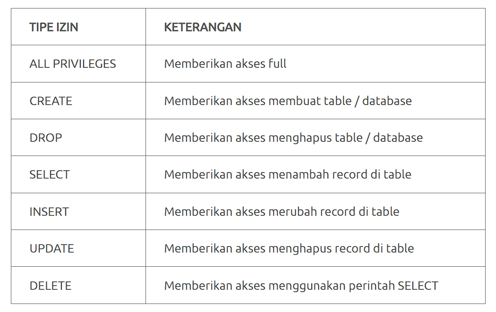
## Grant
Perintah **GRANT** memungkinkan pemberikan hak akses kepada pengguna. Tidak harus setiap pengguna database dapat mengakses seluruh data di database. Ada pengguna yang hanya dapat melakukan operasi di satu table saja. Bisa juga pengguna hanya dapat melakukan operasi SELECT saja tanpa bisa melakukan manipulasi data. **Maka itulah diperlukan manajemen hak akses dengan GRANT**

**Struktur Query GRANT**
```mysql
GRANT tipe_izin ON nama_database.nama_table TO ‘nama_user’@'localhost’;
atau
GRANT SELECT ON nama_database TO nama_user;
```
**Contoh Query GRANT dengan tipe_izin SELECT**
```mysql
GRANT SELECT ON sekolah TO 'username'@'localhost';
```

### Langkah-Langkah
1. Pertama Masuk ke phpMyAdmin dan login sebagai user root
2. 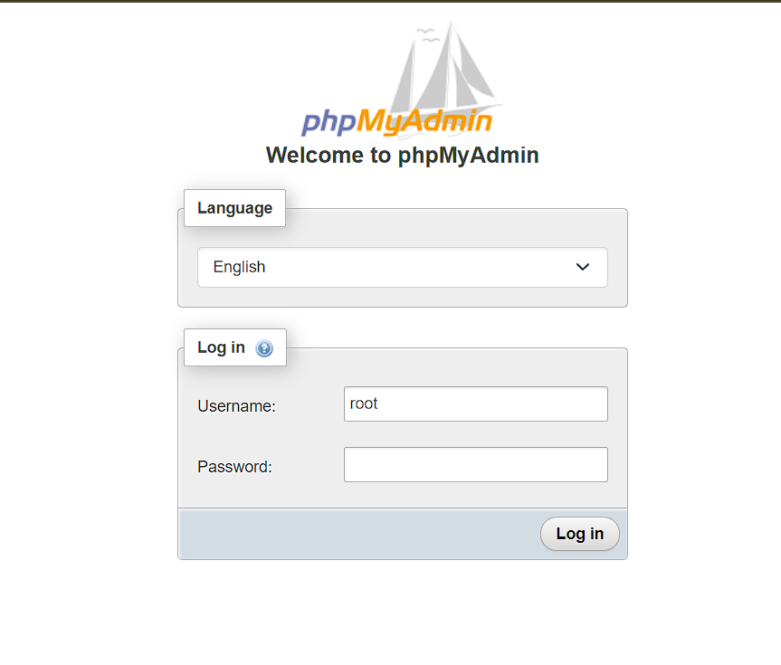
3. Setelah login, terdapat navigasi di atas yaitu `User accounts` 
4. 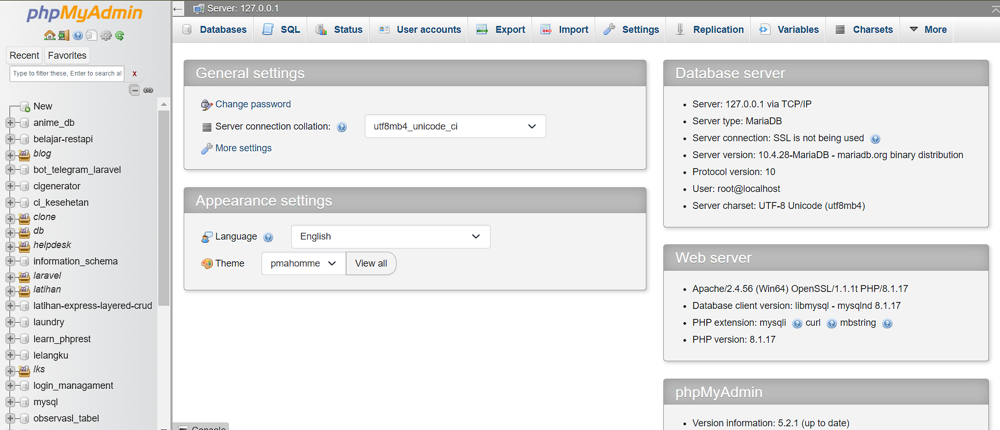
5. Setelah Anda klik, maka tampilannya seperti gambar dibawah ini.
6. 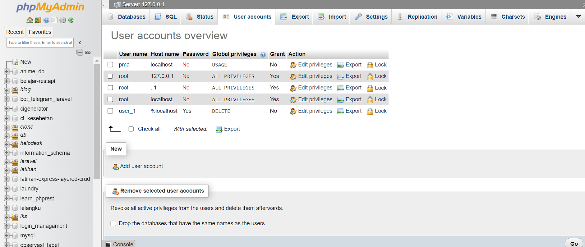
7. Kemudian, untuk membuat user baru, klik tombol `Add user account`
8. 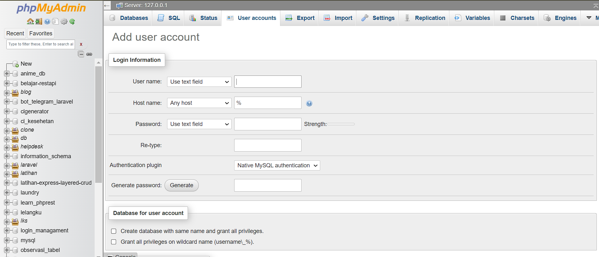
9. Isilah inputannya sesuai dengan user yang anda inginkan
**Penjelasan masing masing inputannya**
	1. **User name**: Input ini digunakan untuk memasukkan nama pengguna baru. Anda dapat mengetikkan nama pengguna secara manual dengan memilih "Use text field".
	2. **Host name** : Pilihan ini menentukan dari mana pengguna dapat terhubung ke server MySQL. Beberapa opsi yang tersedia:
	    - `Any host (%`: Mengizinkan koneksi dari mana saja.
	    - `localhost`: Mengizinkan koneksi hanya dari localhost.
	    - `Specific host name`: Anda dapat mengetikkan nama host tertentu.
	3. **Password**: Input ini digunakan untuk memasukkan kata sandi pengguna baru. Pilih "Use text field" untuk memasukkan kata sandi secara manual
	4. **Re-type**: Input ini digunakan untuk mengonfirmasi kata sandi dengan mengetikkannya kembali.
	5. **Database for user account**:
	    - **Create database with same name and grant all privileges**: Pilihan ini akan membuat basis data baru dengan nama yang sama seperti nama pengguna dan memberikan semua hak akses ke pengguna tersebut.
	    - **Grant all privileges on wildcard name (username_%)**: Pilihan ini akan memberikan semua hak akses pada basis data yang sesuai dengan pola wildcard nama pengguna diikuti oleh karakter wildcard (%).
	6. **Global privileges**:
	    - **Check all**: Kotak centang ini digunakan untuk memilih semua hak akses yang tersedia di bawah ini secara global.
	7. **Hak akses yang tersedia**:
	    - **Data**: Meliputi hak akses untuk manipulasi data seperti SELECT, INSERT, UPDATE, DELETE, dan FILE.
	    - **Structure**: Meliputi hak akses untuk manipulasi struktur basis data seperti CREATE, ALTER, INDEX, DROP, dan lainnya.
	    - **Administration**: Meliputi hak akses administratif seperti GRANT, SUPER, PROCESS, RELOAD, dan sebagainya.
	8. **Resource limits**:
	    - **MAX QUERIES PER HOUR**: Batas maksimum jumlah query yang bisa dijalankan oleh pengguna per jam.
	    - **MAX UPDATES PER HOUR**: Batas maksimum jumlah update yang bisa dilakukan oleh pengguna per jam.
	    - **MAX CONNECTIONS PER HOUR**: Batas maksimum jumlah koneksi yang bisa dibuat oleh pengguna per jam.
	    - **MAX USER CONNECTIONS**: Batas maksimum jumlah koneksi simultan yang bisa dibuat oleh pengguna.
	9. **SSL**:
	    
	    - Pilihan pengaturan SSL untuk koneksi pengguna:
	        - **REQUIRE NONE**: Tidak membutuhkan SSL.
	        - **REQUIRE SSL**: Membutuhkan SSL.
	        - **REQUIRE X509**: Membutuhkan sertifikat X509.
	        - **SPECIFIED**: Pengaturan SSL spesifik lainnya.

10. 
11. 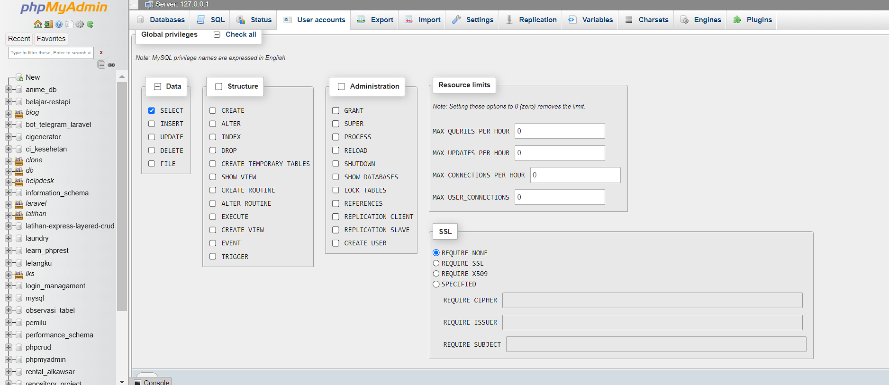
12. Disini saya hanya memberi akses `select` pada user yang saya buat.
13. Kemudian klik tombol `go` untuk menyelesaikan pembuatan user
14. 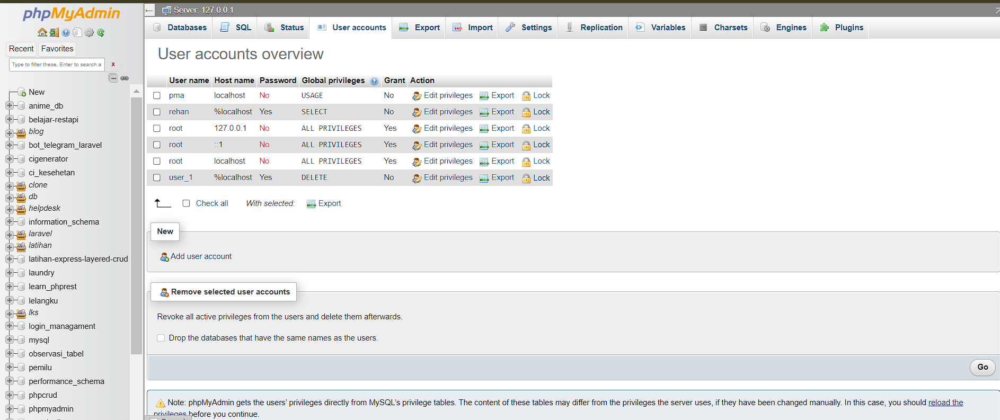
15. Untuk mengecek user yang kita buat berhasil atau tidak silahkan logout
16. Klik tombol logout seperti gambar di bawah ini.
17. 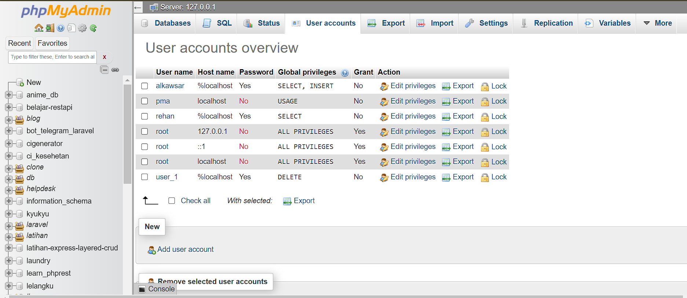
18. Kemudian, login sebagai user yang sudah kita buat sebelumnya
19. 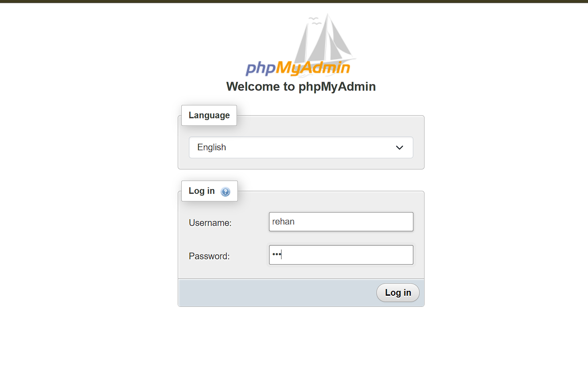
20. Selanjutnya klik tombol `Log in`
21. 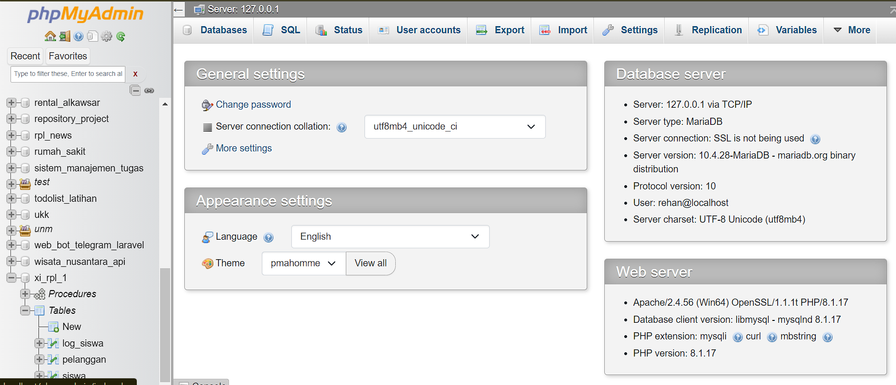
22. Karena sebelumnya user yang kita buat hanya memberikan akses `SELECT`, maka untuk melakukan operasi selain `SELECT` pasti gagal, mari kita lihat
23. 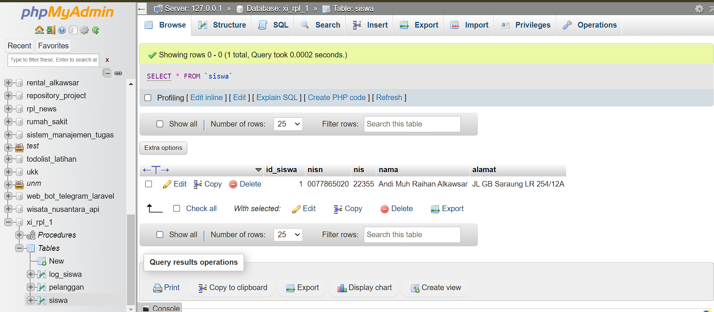
24. 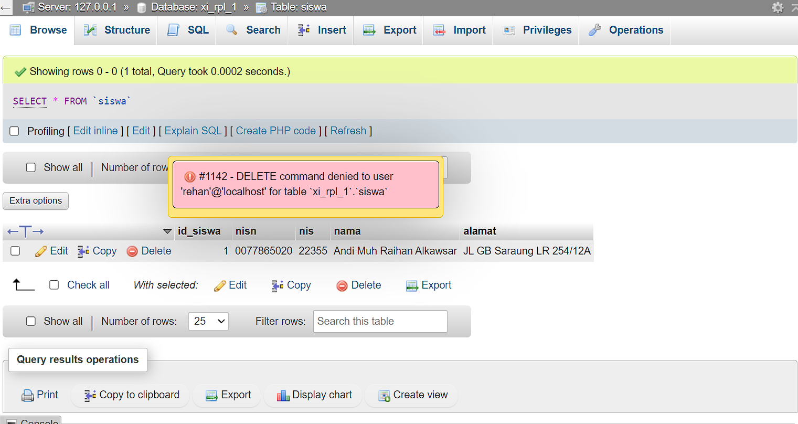
25. Pesan error berikut menyampaikan bahwa user'`rehan` tidak dapat melakukan perintah `DELETE`
26. Maka dari itu, Kita telah berhasil membuat user dan memberikan akses, pada phpMyAdmin

## Revoke
Perintah **REVOKE** digunakan untuk mencabut kembali hak akses yang diberikan melalui perintah GRANT

**Struktur Query REVOKE**
```mysql
REVOKE tipe_izin ON nama_database.nama_table FROM 'nama_user'@'localhost';
atau
REVOKE tipe_izin ON nama_database FROM 'nama_user'@'localhost';
```

**Contoh Query REVOKE**
```mysql
REVOKE INSERT ON sekolah FROM 'username'@'localhost';
```
Untuk langkah-langkah mencabut kembali akses user kita menggunakan PhpMyAdmin
### Langkah-Langkah
1. Pertama Masuk ke phpMyAdmin dan login sebagai user root
2. 
3. Setelah login, terdapat navigasi di atas yaitu `User accounts` 
4. 
5. Setelah Anda klik, maka tampilannya seperti gambar dibawah ini.
6. 
7. Kemudian kita dapat mencabut aksesnya dengan menekan tombol `Edit Privileges`.
9. 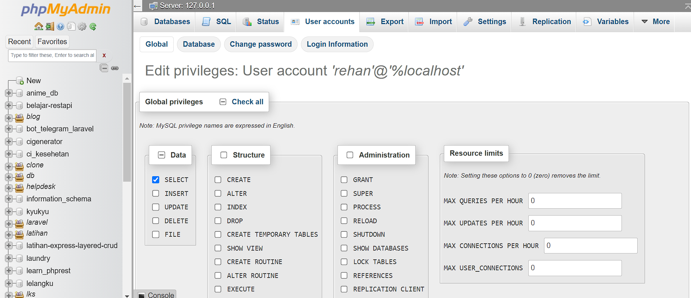
10. Setelah Anda klik, Anda dapat mencabut akses nya dengan mematikan centang pada akses yang ingin kita cabut
11. 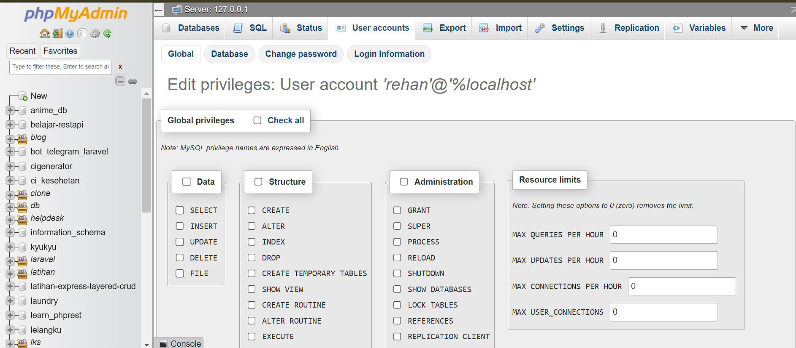
12. Kemudian klik tombol go
13. 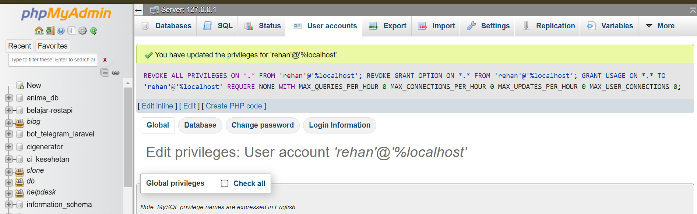
14. Kita telah berhasil mencabut hak akses kepada user `rehan`